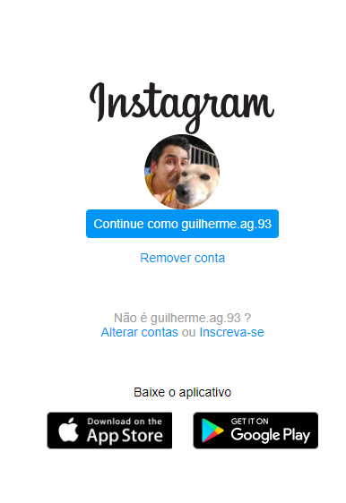

# Recriando a página inicial do Instagram

O objetivo desse projeto foi colocar em prática os conhecimentos adquiridos durante o curso da [Digital Innovation One](https://www.dio.me/).

## Tecnologias utilizadas

- HTML.
  
- CSS.
  
## Preview do projeto

Preview mobile

Preview desktop

## Como testar o projeto

### Opção 1: Clone o repositório e abra remotamente

Digite no seu terminal

``
git clone https://github.com/guilhermag/dio-login-instagram.git
``

``
cd dio-login-instagram/
``

Agora é só abrir o ``index.html``.

## Créditos

Desenvolvido por Guilherme de Araujo Gabriel.

